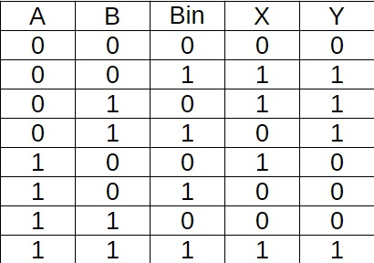
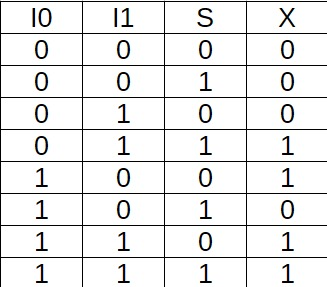

# Jogo de Adivinhação Guess the Number

## 💡 Sobre o projeto
Esse circuito é referente ao projeto proposto na cadeira de Circuitos Digitais da UFCA e foi construído no Logisim ITA. O mesmo trata-se de um jogo onde um número é sorteado e o usuário deve tentar adivinhar qual foi.

## 🎲 Como jogar
1 - Um número de 4 bits é sorteado.  
2 - O jogador dá um palpite de um número de 4 bits.  
3 - Um led rgb indicador acende indicando a proximidade dos números. Quanto mais próximo o palpite, mais vermelho o led acenderá e quanto mais distante mais azul o led será.  
4 - Ao acerto o número sorteado, um segundo led acende em verde indicando a vitória no jogo.  
5 - Caso outro número seja sorteado, ambos os leds de proximidade e acerto se apagam indicando o recomeço do jogo. 

## ⚙️ Funcionalidades
* Geração de número aleatório a cada rodada.
* Sistema de confirmação de palpite do usuário.
* Led rgb indicador de proximidade.
* Led indicador de acerto.
* Sistema de reinício ao sortear outro número.

## 📝 Tabelas Verdade
Subtrator 1 bit  
  
Multiplexador 1 bit  

